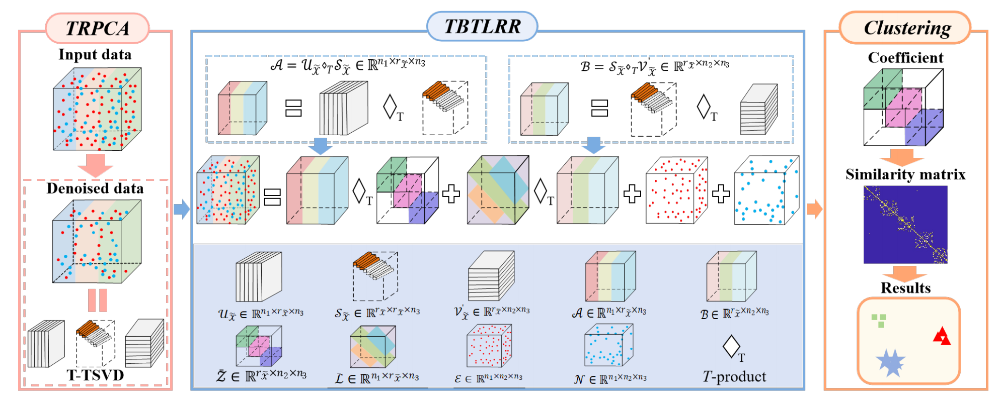

# TBTLRR

The code in this toolbox implements "Data-Adaptive Transformed Bilateral Tensor Low-Rank Representation for Clustering" by <i>H. Chen, X. Wang, X. Xiu, W. Liu</i>.

### Testing
Directly run demo.m for reproduction.
